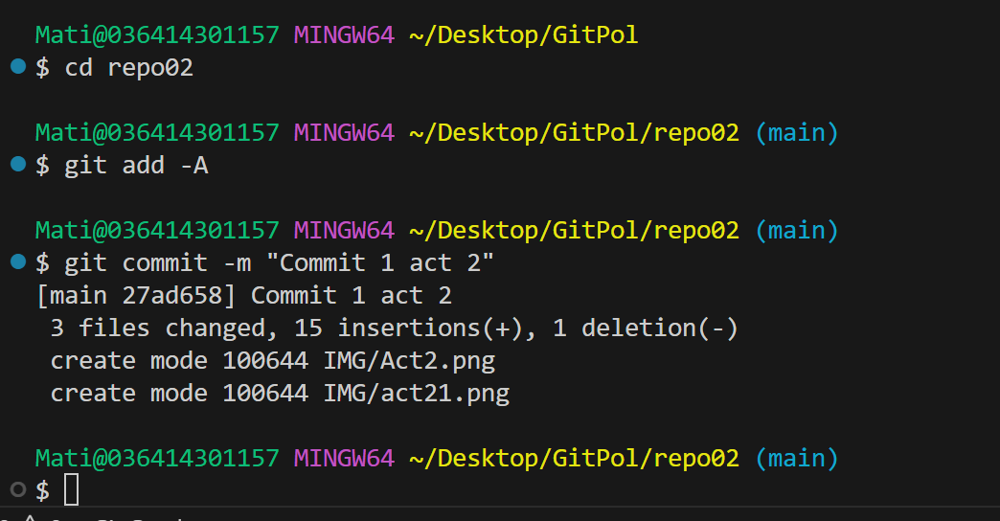

# Excercici 2

## Excercici 2.1

*Creem new repositority amb el nom que volem*  

**********

## Excercici 2.2

*Clonem amb clone*  

**********

## Excercici 2.3

*Primer un add per stashing i despres commit*  

**********

## Excercici 2.4
|    **Comando**   |      **Funció**     |   **Exemple**   |
|:----------------:|:-------------------:|:----------------:|
|      add -A      |     Staging area    | Esperant al avio |
|  commit -m "msj" | Al repositori local |      Al avió     |
| push origin main |  Del local al remot |      Volant      |